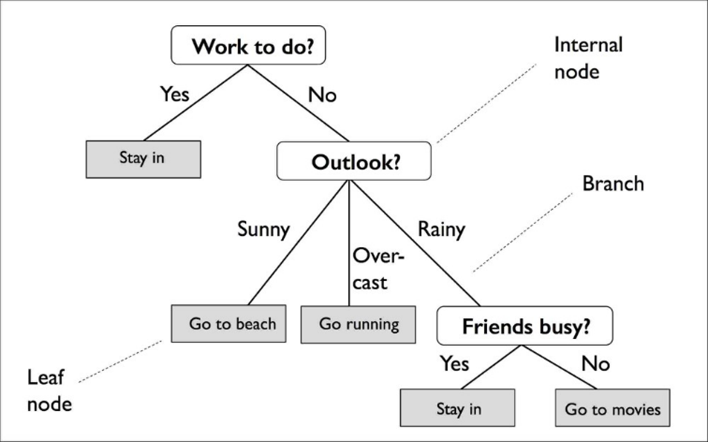
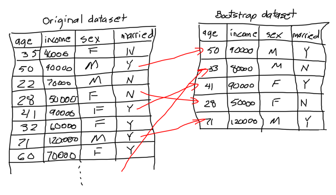

## Objectives: 
The goal of this presentation and vignette is to descriptively explore classification trees and random forests as the premise of our Applied Data Analysis Class final project. We have included a custom package {adaRFTrain} as well as examples of this package at work using the Iris data set acquired from Kaggle. 

## Preliminaries 
Load the following packages into **_R_**
```{r}
library(devtools)
library(usethis)
#library(adaRFTrain)
library(caret)
```

Load in the Iris dataset 

```{r}
f <- "https://raw.githubusercontent.com/ningzesun1993/adaRFTrain/master/Iris.csv"
df <- read.csv(f)

head(df)
```

##  Decision Trees
A decision tree is a type of machine learning in which an algorithm predicts a result based on features of data. Visually, these trees create an interpretable walk through for how outputs are determined. 
```{r}

```
 
Each internal node breaks off into leaves. Each leaf is a class or a probability distribution of the class. By splitting the source set of data into subsets, leaves are made based on attribute value tests. This recursive partitioning is repeated on each derived subset.  
The data is initially split based on a feature that results in the largest Information Gain (IG). The goal is to calculate how much accuracy each split will cost us. The split that costs least is chosen as a new node. To find the IG of each node, you use the following equation.


```{r}

```

There are two main types of decision trees. 
1.	Classification – the output is a nominal variable. Discrete. Class. Categorical
2.	Regression – the output is a real number. Continuous. Numerical

We focused on classification trees for this project. 


## Classification Trees
#### **Background**

A classification tree visually represents a type of algorithm that is used for a classification task, such as when data needs to be categorized into classes that belong to a specif response variable. The algorithm identifies the "class" that the variable of interest would fall into. 

```{r}
knitr::include_graphics("Images/donut tree.png")
```

#### **How they work**
Classification trees are based on the homogeneity of the data. Measures of impurities (such as entropy or Gini index) quantify the homogeneity. Entropy measures how much information is expected to be gained. By using the following equation, you can split the dataset into subsets using the attribute that gives minimized entropy after splitting. 

```{r}

```

We are interested in the if-then conditions therefore we can disregard the assumption that the variables are linear. The dependent variable can assume either a number of different variables or one mutually exclusive value. The categorical variables can be numerous. 

#### **Limitations and Disadvantages**
One common limitation includes the likeliness that data will be overfit. You can use pruning to avoid overfitting and find overall optimal. There is also a high chance of the variance affecting the prediction.To help reduce this, you can introduce multiple criteria to measure the information gains. Additionally, there is low bias which can make it difficult to incorporate new data once the tree has already been established. 
Handle the continuous attribute by introducing threshold for splits
Handle missing values by not using that missing values in calculation


## Random Forests
Random forest is an ensemble of machine learning algorithms that is operated by building multiple decision trees. It can be used as a classification or regression model .All decision trees in the forest are trained on a bootstrapped ,which is a subset of the dataset.
```{r}

```


## References 
https://www.tutorialspoint.com/big_data_analytics/decision_trees.htm#:~:text=A%20Decision%20Tree%20is%20an,such%20as%20classification%20or%20regression.&text=Each%20leaf%20of%20the%20tree,on%20an%20attribute%20value%20test.
