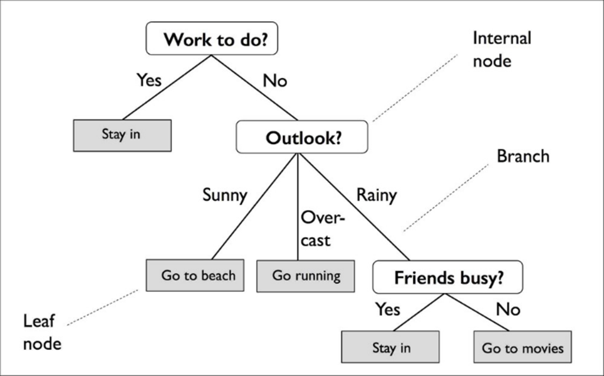

### Team member: Ningze Sun, Brandi Christiano, Janna Muhanmmad

```{r, include = FALSE}
knitr::opts_chunk$set(
  collapse = TRUE,
  comment = "#>"
)
```


## Objectives: 
The goal of this presentation and vignette is to descriptively explore classification trees and random forests as the premise of our Applied Data Analysis Class final project. We have included a custom package {adaRFTrain} as well as examples of this package at work using the Iris data set acquired from Kaggle. 


## Preliminaries 
Load the following packages into **_R_**

Please use this command to install adaRFTrain:


And please command out devtools::load_all(".") if you want to run it

```{r setup}
devtools::load_all(".")
library(adaRFTrain)
library(caret)
library(superml)
```

Load and modify in the Iris dataset 

```{r data}
data(iris)
df = iris
df$Species = as.factor(LabelEncoder$new()$fit_transform(df$Species))
head(df)
```

##  Decision Trees

A decision tree is a type of machine learning in which an algorithm predicts a result based on features of data. Visually, these trees create an interpretable walk through of how outputs are determined. 


{width=500px}

### Introduction

Each internal node breaks off into leaves. Each leaf is a class or a probability distribution of the class. By splitting the source set of data into subsets, leaves are made based on attribute value tests. This recursive partitioning is repeated on each derived subset.

The data is initially split based on a feature that results in the largest Information Gain (IG). The goal is to calculate how much accuracy each split will cost us. The split that costs least is chosen as a new node. To find the IG of each node, you use the following equation.


{width=300px}


There are two main types of decision trees. 

1.	Classification – the output is a nominal variable. Discrete. Class. Categorical

2.	Regression – the output is a real number. Continuous. Numerical

We focused on classification trees for this project.


## Classification Trees of ID3

#### **Background**

A classification tree visually represents a type of algorithm that is used for a classification task, such as when data needs to be categorized into classes that belong to a specif response variable. The algorithm identifies the "class" that the variable of interest would fall into. 


{width=500px}


#### **How they work**


Classification trees are based on the homogeneity of the data. Measures of impurities (such as entropy or Gini index) quantify the homogeneity. Entropy measures how much information is expected to be gained. By using the following equation, you can split the dataset into subsets using the attribute that gives minimized entropy after splitting.

{width=300px}


We are interested in the 'if-then' conditions, therefore we can disregard the assumption that the variables are linear. The dependent variable can assume either numerous different variables or one mutually exclusive value. The categorical variables can be numerous. 

#### **Limitations and Disadvantages**

One common limitation includes the likeliness that data will be overfit. You can use pruning to avoid overfitting. There is also a high chance of the variance affecting the prediction. Additionally, there is low bias which can make it difficult to incorporate new data once the tree has already been established. 

## Classification Trees of C4.5

calcuate normalized information gain instead of entropy

Improvement from ID3:

Handle the continuous attribute by introducing threshold for splits

Handle missing values by not using that missing values in calculation
  
Use pruning to avoid overfitting and find overall optimal


### Code example of classification tree

Hyper parameter for tree function in R

Weights: vector of non-negative observational weights

method: character string giving the method to use

Split: splitting criterion

The example of the decision tree:

To generate the dataset, we used iris dataset and need to change the target species with label encoder


And we use our own function from our packages to train and predict the dataset:

The split is default with 0.2 test randomly, the parameter is:

method: "recursive.partition"

split: c("deviance", "gini")

The inputs of dt_train function are:

df: total dataframe if df_test is not specified else train data frame

formula: the formula of the model, can be not speicified if target is specified

df_test: test data frame

p: the ratio of split, have to be specified if df_test is not, default: 0.8

params_: the parameters of decision tree, have to be a list with method and split:

  method: character string giving the method to use. default: "recursive.partition"
  
  split: Splitting criterion to use. default: c("deviance", "gini")
  
target: the target of the model, have to be specified if formula is not

```{r dt}
formula = "Species ~ ."
dt_r = dt_train(df, formula)
head(dt_r)
```


```{r dt_code}
# dt_train <- function(df, formula = NULL, df_test = NULL, p = 0.8,
#                      params_ = list(method = "recursive.partition",
#                                     split = c("deviance", "gini")),
#                      target = NULL) {
#   if (!is.null(target)){df[[target]] = as.factor(df[[target]])}
#   if (is.null(df_test)){
#     if (is.null(target)){target = names(df)[[length(names(df))]]}
#     index = caret::createDataPartition(y = df[[target]], p = p, list = FALSE)
#     df_train = df[index,]
#     df_test = df[-index,]
#   }else{
#     df_train = df
#   }
#   df_t = df_test[,!(names(df_test) %in% c(target))]
#   if (is.null(formula)){formula = paste0(target, " ~ .")}
#   dt = tree::tree(as.formula(formula), data = df_train, method = params_[["method"]],
#                   split = params_[["split"]])
#   dt_p = predict(dt, newdata = df_t, type = "class")
#   df_test = data.frame(cbind(df_test, dt_p))
#   return(df_test)
# }

```


## Random Forest

### Introduction

Ensemble is a method to combine the weak learner to be a strong learner.

There are 3 methods of ensemble: bootstrap aggregating, boosting and stacking

bagging (bootstrap aggregating), that often considers homogeneous weak learners, learns them independently 
from each other in parallel and combines them following some kind of deterministic averaging process

boosting, that often considers homogeneous weak learners, learns them sequentially in a very adaptative way 
(a base model depends on the previous ones) and combines them following a deterministic strategy

stacking, that often considers heterogeneous weak learners, learns them in parallel and combines them 
by training a meta-model to output a prediction based on the different weak models predictions

In random forest, bagging is performed to decision trees.

random forest can be used as a classification or regression model .

All decision trees in the forest are trained on a bootstrapped, which is a subset of the dataset.

So the basic idea of random forest is to select predefined rows and several attributes randomly with replacements 
to train different models and combine the prediction to final results, voting for classification and averaging 
for regression

A random forest is an ensemble of machine learning algorithms that is operated by building multiple decision trees. It can be used as a classification or regression model. All decision trees in the forest are trained on a bootstrapped, which is a subset of the dataset.


The out of bag dataset refers to the portion of samples that were not included in the construction of the 
decision tree, but the model evaluates its perfromae by running the samples that were not included 
in the construction through the forest.

In a random forest we randomly select a predefined number of features to split a decision tree which results in a larger variance between trees.

Theoretically and statistically, decsion tree has a low bias but high variance and bagging can reduce the variance of weak learner if the bias is low for the weak learner.


#### Classification : 
When a random forest is presented with a new sample it takes the majority prediction made by each decision tree in the forest and makes the final prediction.

#### Regression 
Uses the average of each individual decision tree in the forest.

Advantage :

Automatic selection of variables; Has built in estimate of accuracy;

Fast and effective for large datasets 

Flexibility to include data from previous node in the same tree 

Disadvantage :
A large amount of trees can make the model slow and not effective for real time predictions

No regularization to avoid overfitting, therefore super easy to be overfitting

Coding limitation so it is not handle multi-processor well.

Perform not good with large dataset for both time-consuming and accuracy

Not perform well with spare matrix


### code example for random forest

(In the parentheses)

hyper parameter for randomforest function:

Ntree: number of trees to grow. (n_estimaters)

Mtry: number of variables randomly sampled as candidates at each split.(max_features)

Replace: should sampling of cases be done with or without replacement(bootstrap)

Strata: used for stratified sampling

Sampsize: size of sample to draw(max_samples)

Nodesize: minimum size of terminal nodes (min_samples_leaf)

Maxnodes: maximum number of terminal nodes trees in the forest can have (max_leaf_nodes)

Importance: should importance of predictors be assessed?

The input of rf_train function are:

df: total dataframe if df_test is not specified else train data frame

formula: the formula of the model, can be not speicified if target is specified

df_test: test data frame

p: the ratio of split, have to be specified if df_test is not, default: 0.8

params_: the parameters of random forest, have to be a list with all parameters if specified:

  ntree: Number of trees to grow, default: 500

  sampsize: Size(s) of sample to draw, default: total row of train dataset

  nodesize: Minimum size of terminal nodes, default: NULL

  maxnodes: Maximum number of terminal nodes trees in the forest can have, default: NULL

  replace: Should sampling of cases be done with or without replacement?, default: TRUE

  mtry: Number of variables randomly sampled as candidates at each split, default: floor of square of features

  strata: A (factor) variable that is used for stratified sampling, default: target

target: the target of the model, have to be specified if formula is not


```{r rf}
formula = "Species ~ ."
rf_r = rf_train(df, formula)
head(rf_r)
```

```{r rf_code}
# rf_train <- function(df, formula = NULL, df_test = NULL, p = 0.8,
#                      params_ = list(ntree = 500, sampsize = NULL, nodesize = NULL,
#                                     maxnodes = NULL, replace = TRUE, mtry = NULL,
#                                     strata = NULL), target = NULL) {
#   if (!is.null(target)){df[[target]] = as.factor(df[[target]])}
#   if (is.null(df_test)){
#     if (is.null(target)){target = names(df)[[length(names(df))]]}
#     index = caret::createDataPartition(y = df[[target]], p = p, list = FALSE)
#     df_train = df[index,]
#     df_test = df[-index,]
#     df_t = df_test
#   }else{
#     df_train = df
#   }
#   df_t = df_test[,!(names(df_test) %in% c(target))]
#   if (is.null(formula)){formula = paste0(target, " ~ .")}
#   if (is.null(params_[['sampsize']])){params_[['sampsize']] = nrow(df_train)}
#   if (is.null(params_[['mtry']])){params_[['mtry']] = floor(sqrt(ncol(df_train)))}
#   if (is.null(params_[['strata']])){params_[['strata']] = target}
#   rf = randomForest::randomForest(as.formula(formula), data = df_train, ntree = params_[['ntree']],
#                                   sampsize = params_[['sampsize']], nodesize = params_[['nodesize']],
#                                   maxnodes = params_[['maxnodes']], replace = params_[['replace']],
#                                   mtry = params_[['mtry']], strata = params_[['strata']])
#   rf_p = predict(rf, newdata = df_t, type = "class")
#   df_test = data.frame(cbind(df_test, rf_p))
#   return(df_test)
# }

```

## k-fold cross validation and grid search

### background

If we want to tune the hype-paraeter, we have to avoid overfitting, one of way is using cross validation

K-fold cross validation: the training set is split into k smaller sets (randomly or sequentially). The following procedure is followed for each of the k “folds”:

A model is trained using k-1 of the folds as training data;

the resulting model is validated on the remaining part of the data.

Repeat k times untill all small datasets are validated and average the results.

Grid search: using same space for tunning the hyper parameter or manually specified list of hyper-parameters.


### code example

In this function, we only tune the random forest hyper parameters since tree have no hyper parameters needed to be tuned.

df: total dataframe

params_range: a list of parameters to tune

target: the target of the model

n_fold: number of folds to use to split the train data, default: 3

scoring: scoring metric used to evaluate the best model, default: c("accuracy", "auc")

params_: the parameters of random forest, have to be a list with all parameters:

  ntree: Number of trees to grow, default: 500

  sampsize: Size(s) of sample to draw, default: total row of train dataset

  nodesize: Minimum size of terminal nodes, default: NULL

  maxnodes: Maximum number of terminal nodes trees in the forest can have, default: NULL

  replace: Should sampling of cases be done with or without replacement?, default: TRUE

  mtry: Number of variables randomly sampled as candidates at each split,default: floor of square of features

  strata: A (factor) variable that is used for stratified sampling, default: target


```{r grid_search}
target = "Species"
params_range = list(n_estimators = seq(50, 200, 10), max_depth = seq(2, 10, 2))
params = grid_search_rf(df, params_range, target = target)
print(params)

```


```{r grid_search_code}
# grid_search_rf <- function(df, params_range, target, n_fold = 3, scoring = c("accuracy", "auc"),
#                            params_ = list(ntree = 500, sampsize = NULL, nodesize = NULL,
#                                           maxnodes = NULL, replace = TRUE, mtry = NULL,
#                                           strata = NULL)) {
#   if (!is.null(target)){df[[target]] = as.factor(df[[target]])}
#   if (!is.null(df_test)){if (is.null(target)){target = names(df)[[length(names(df))]]}}
#   if (is.null(params_[['sampsize']])){params_[['sampsize']] = nrow(df_train)}
#   if (is.null(params_[['mtry']])){params_[['mtry']] = floor(sqrt(ncol(df_train)))}
#   if (is.null(params_[['strata']])){params_[['strata']] = target}
#   rf = superml::RFTrainer$new()
#   rf_grid = superml::GridSearchCV$new(trainer = rf, parameters = params_range,
#                          n_folds = n_fold, scoring = scoring)
#   rf_grid$fit(df, target)
#   result = rf_grid$best_iteration(metric = NULL)
#   for (i in names(params_range)){
#     params_[[i]] = result[[i]]
#   }
#   return(params_)
# }


```


